# Team Inspire - Hacfest 2024 Participant
1. Aldy Rahman - Hacker
2. Rama Noor Rizki - Hacker
3. Rifky Fauzan Rusadi - Hustler
4. M. Alfi Rizki - Hipster

# Trash2Cash Web Application

Trash2Cash is a web-based application with the main feature of PickUp Trash where we provide waste collection services to users. In accordance with our motto "Turn Trash to Cash", we hope to reduce waste by buying waste sold by users.

Route Page:

### Sign-Up: `/sign-up`

Page: `src/pages/SignUp.jsx`

Sign-Up page is a page that serves to create an account before being able to Sign-In in the application.

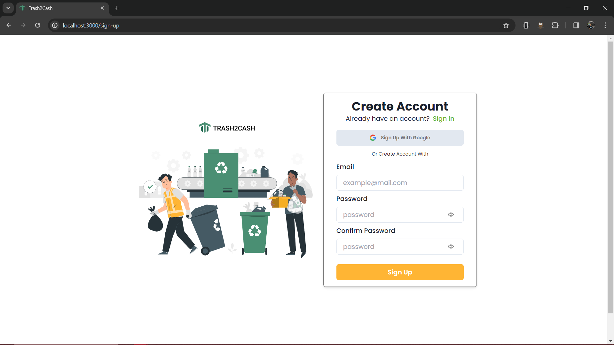

### Sign-In: `/sign-in`

Page: `src/pages/SignIn.jsx`

Sign-In page is a web page or interface specifically designed for users to enter their authentication credentials in order to access our application.

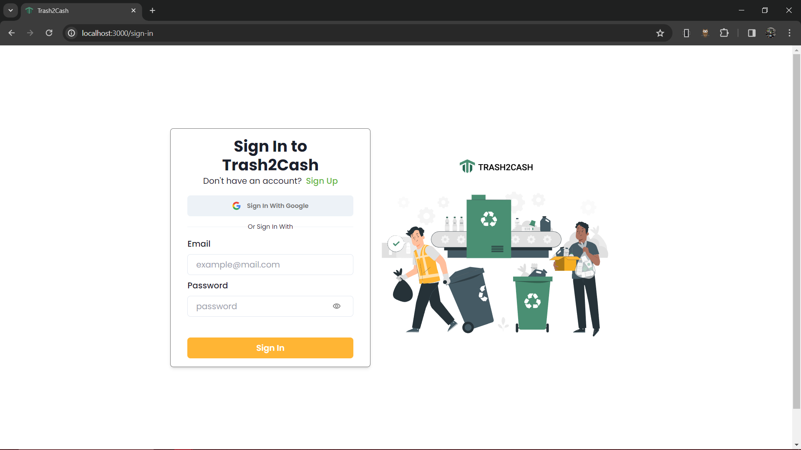

### Homepage: `/`

Page: `src/pages/Home.jsx`

Homepage that contains the sign out feature. Homepage is still under development so it contains a sign out feature.

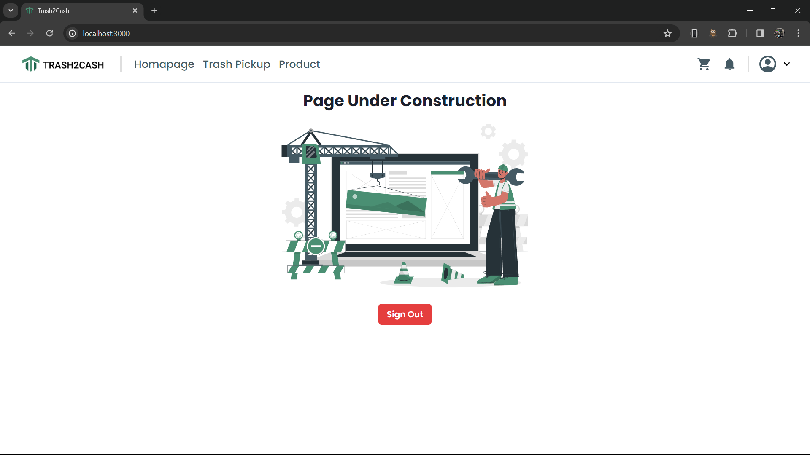

### Pickup: `/pickup`

Page: `src/pages/TrashPickup.jsx`

On the trashpickup page there is a trashbank list that users can choose from as well as a search and sort feature to make it easier for users to find their favorite trashbank.

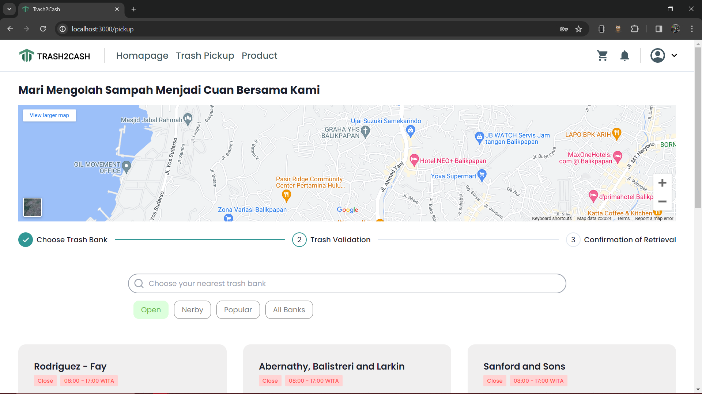

### PickUp Validation: `/pickup/:BankId`

Page: `src/pages/TrashPickupValidation.jsx`

This page is a useful feature for users to be able to validate the garbage they want to sell. Here the user must upload a photo of the garbage, the type of garbage and a description of their garbage.

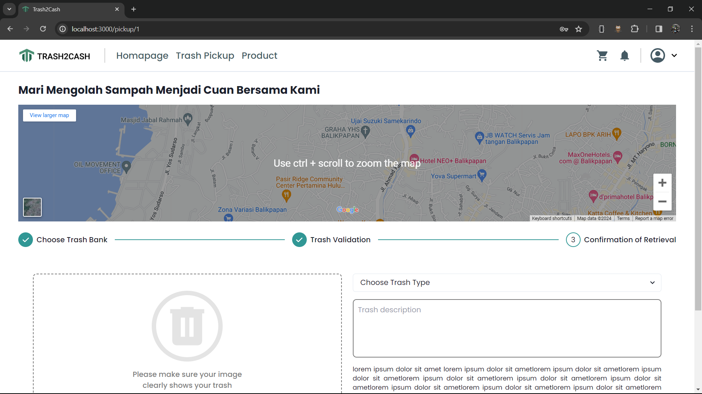

### PickUp Confirmation: `/pickup/:BankId/confirmation`

Page: `src/pages/TrashPickupConfirmation.jsx`

This page displays realtime progress details of the garbage to be sold.

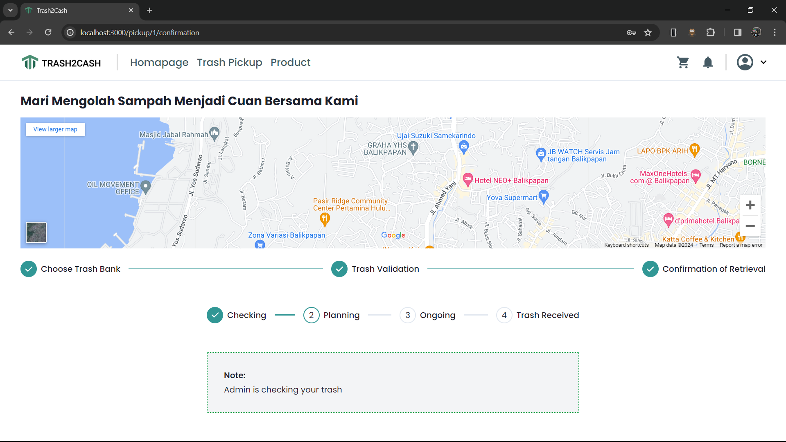

### Product: `/product`

Page: `src/pages/Product.jsx`

This page displays a list of products that we offer. this product is the result of waste that we have processed.

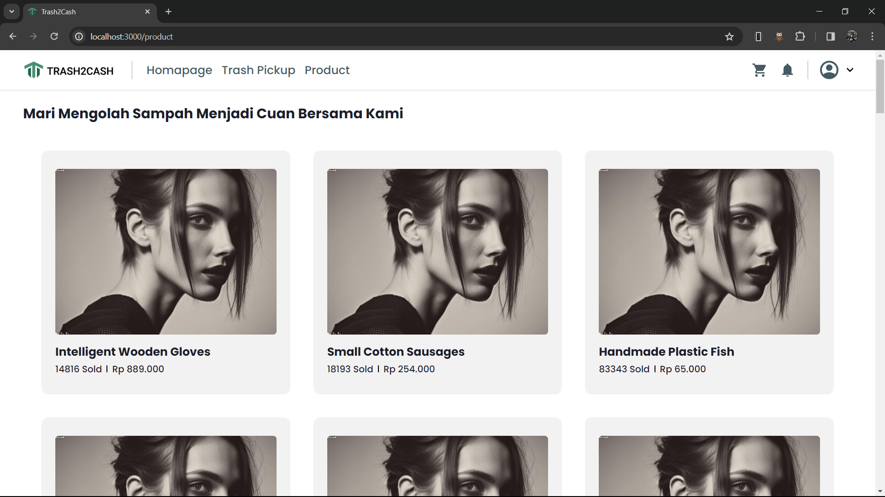

### Product Detail: `/product/:ProductId`

Page: `src/pages/ProductDetail.jsx`

This page displays details of the products we sell such as compost and recycled accessories.

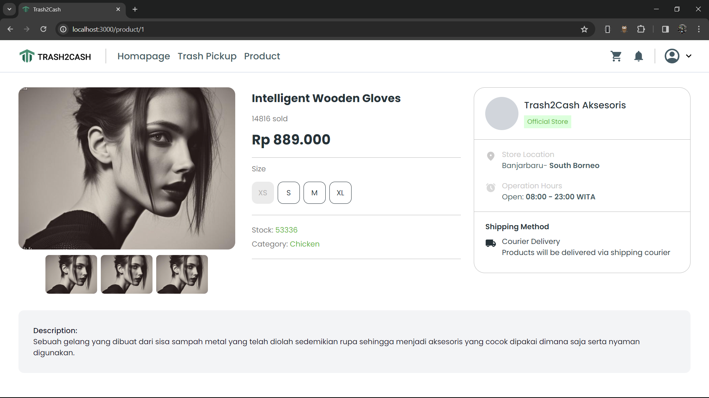

### Product For Admin: `admin/product/`

Page: `src/pages/ProductList.jsx`

This is a page that displays a list of product data that we will sell from the admin side. this page contains search, add product, change product and delete product features.

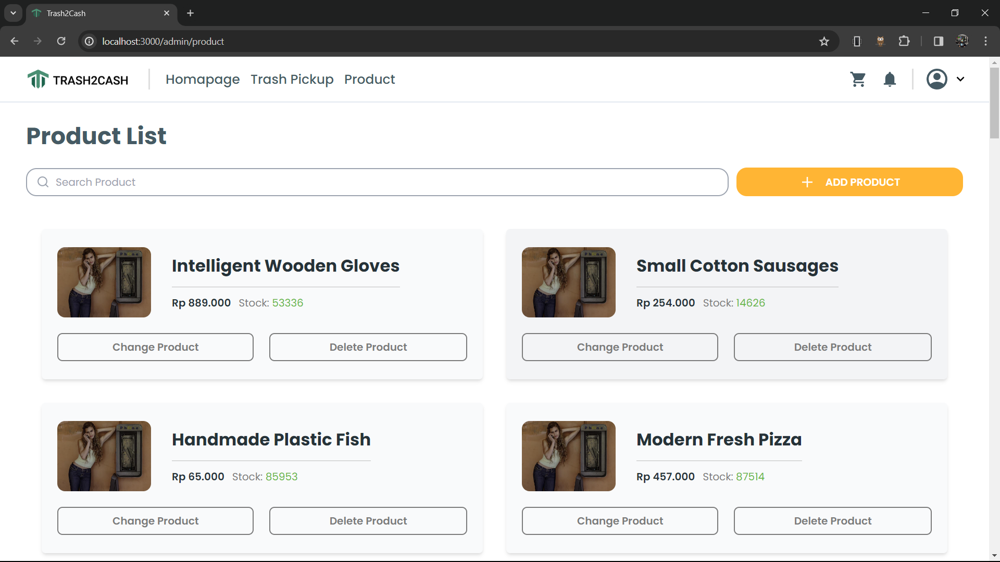

### Add or Edit Product For Admin: `admin/product/:ProductId`

Page: `src/pages/AddProduct.jsx`

This is a page that functions for admins to add products to be sold or change product data details.

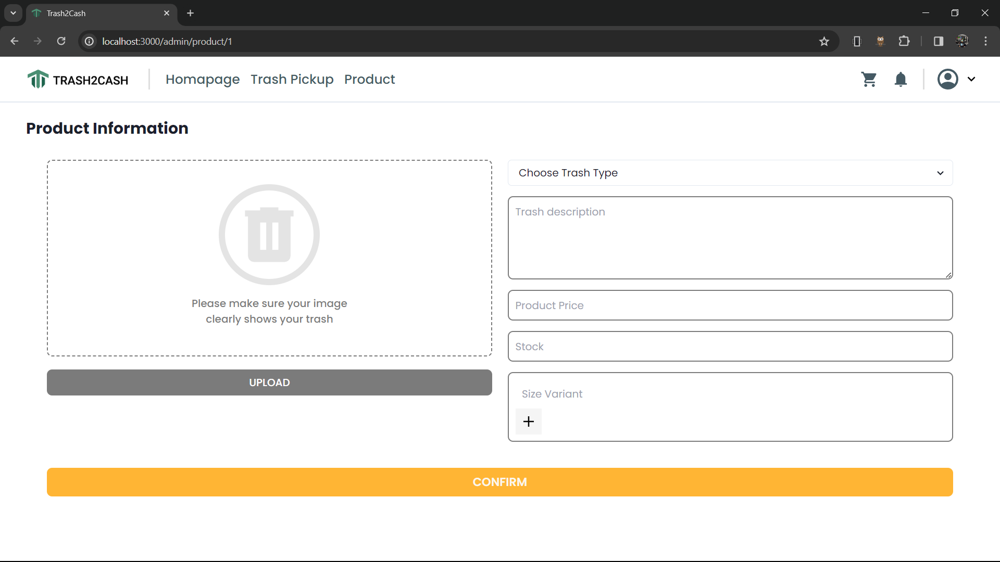

### Pickup Confirmation For Admin: `admin/pickup`

Page: `src/pages/PickupConfirmation.jsx`

This is a page that contains a list of requests for confirmation of garbage collection from users. Here the admin will confirms the request for garbage collection from the user.

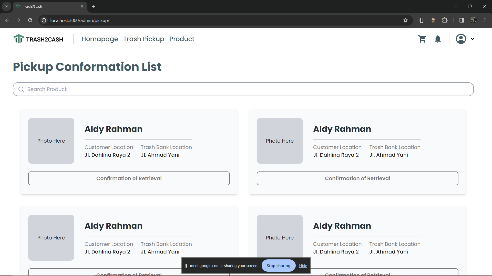
